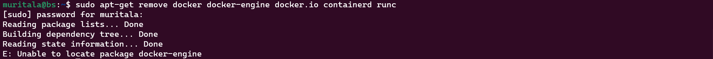

# Installing Docker Engine on Ubuntu

## 1. **Prerequisites:**

**OS requirements:** To install Docker Engine, you need the 64-bit version of Ubuntu.

**Uninstall old versions:** Uninstall any older versions before attempting to install a new one.

```bash
for pkg in docker.io docker-doc docker-compose podman-docker containerd runc; do sudo apt-get remove $pkg; done
```

If no older version is present, below is the output:



## 2. **Installation using the apt repository**

Before installing Docker Engine on a new host machine for the first time, you must set up the Docker repository. Afterward, you can install and update Docker from the repository. 

- Update the `apt` package index and install packages to allow `apt` to use a repository over HTTPS:

```bash
sudo apt-get update
sudo apt-get install ca-certificates curl gnupg
```

- Add Docker’s official GPG key:

```bash
sudo install -m 0755 -d /etc/apt/keyrings
curl -fsSL https://download.docker.com/linux/ubuntu/gpg | sudo gpg --dearmor -o /etc/apt/keyrings/docker.gpg
sudo chmod a+r /etc/apt/keyrings/docker.gpg
```

- Use the following command to set up the repository:

```bash
echo \
  "deb [arch="$(dpkg --print-architecture)" signed-by=/etc/apt/keyrings/docker.gpg] https://download.docker.com/linux/ubuntu \
  "$(. /etc/os-release && echo "$VERSION_CODENAME")" stable" | \
  sudo tee /etc/apt/sources.list.d/docker.list > /dev/null
```

## 2.1. **Install Docker Engine**

- Update the `apt` package index to refresh the apt cache:

```bash
sudo apt-get update
```

- Receiving a GPG error when running `apt-get update`?

```bash
sudo chmod a+r /etc/apt/keyrings/docker.gpg
sudo apt-get update
```

- Selecting the docker repository as the default one

```bash
apt-cache policy docker-ce
```

- Install Docker Engine, containerd, and Docker Compose.

```bash
sudo apt-get install docker-ce docker-ce-cli containerd.io docker-buildx-plugin docker-compose-plugin
```

- Check the status of the Docker

```bash
sudo systemctl status docker
```


## 3. **Install using the convenience script**

Docker provides a convenience script at [https://get.docker.com/](https://get.docker.com/) to install Docker into development environments non-interactively. The convenience script isn’t recommended for production environments, but it’s useful for creating a provisioning script tailored to your needs. 

- You can run the script with the --dry-run option to learn what steps the script will run when invoked:

```bash
curl -fsSL https://get.docker.com -o get-docker.sh
sudo sh ./get-docker.sh --dry-run
```

- This example downloads the script from https://get.docker.com/ and runs it to install the latest stable release of Docker on Linux:

```bash
curl -fsSL https://get.docker.com -o get-docker.sh
sudo sh get-docker.sh
```

- You have now successfully installed and started Docker Engine. The docker service starts automatically on Debian based distributions. On RPM based distributions, such as CentOS, Fedora, RHEL or SLES, you need to start it manually using the appropriate systemctl or service command. As the message indicates, non-root users can’t run Docker commands by default.


## 4. **Manage Docker as a non-root user**

- The Docker daemon binds to a Unix socket, not a TCP port. By default it’s the root user that owns the Unix socket, and other users can only access it using `sudo`. The Docker daemon always runs as the `root` user.

- If you don’t want to preface the docker command with sudo, create a Unix group called docker and add users to it. When the Docker daemon starts, it creates a Unix socket accessible by members of the docker group. On some Linux distributions, the system automatically creates this group when installing Docker Engine using a package manager. In that case, there is no need for you to manually create the group.

- Create the `docker` group and add current user `muritala` to the Docker group to be able to run the docker command.

```bash
sudo groupadd docker && sudo usermod -aG docker $USER
```

- Log out and log back in so that your group membership is re-evaluated or restart the virtual machine for changes to take effect.

- Verify that you can run docker commands without sudo and remove the image from local Docker image repository.

```bash
 docker run --rm hello-world && docker rmi hello-world
 ```

## 5. **Configure Docker to Start on Boot with `systemd`**

Many modern Linux distributions use `systemd` to manage which services start when the system boots. On  `Debian` and `Ubuntu,` the `Docker` service starts on boot by default.

- To automatically start `Docker` and `containerd` on boot for other Linux distributions using systemd, run the following command:

```bash
 sudo systemctl enable docker.service && sudo systemctl enable containerd.service
 ```

- Log out and then in for a change to take effect.

```bash
exit
```

- After logging in, check the docker version to check if the docker client can talk to the docker daemon or server.

```bash
docker --version
```


### Reference: [https://docs.docker.com/engine/install/ubuntu/](https://docs.docker.com/engine/install/ubuntu/)