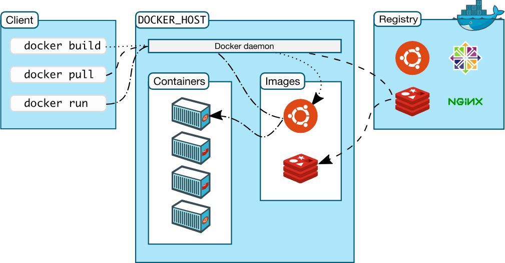

# Overview

The Docker Project started in 2013 and became the de facto standard for executing programs in a portable sandbox environment, known as a container. It is probably one of the reasons for the high rate of cloud adoption in the industry.

One of the predictions of the analyst firm Gartner is that by 2022, 75% of organizations will be running three or more containerized applications in production. So it is high time for organizations to jump on board. Docker changed the IT infrastructure, and everybody uses it. Big cloud providers like Amazon, Microsoft, Google, or any of today's big corporations, use Docker.

This practical project covers how to run containerized applications with Docker. At the end of this project, students will know how to:

1. [Install Docker Engine on Ubuntu](1-installing-docker-engine-on-ubuntu.md),
2. [Understand the Docker Client](2-the-docker-client.md),
3. [Lab: Running Web Servers in a Docker Container](3-lab-running-webservers-in-a-docker-container.md),
4. [Getting Shell Access to a Container](4-getting-shell-access-to-a-container.md), and
5. [Modifying a Container](5-modifying-a-container.md).